Part 5 Control Project
======================

Summary
-------

This project implements a PID controller class as shown in this course. Two PID controllers are then instantiated, one for throttle controlled by speed error, and another for steering controlled by yaw error. So in total 6 paramaters (P, I and D coefficients for both) need to be tuned, so that a simulation car reaches the end of the road.

Quick instructions
------------------

The [Makefile](./Makefile) bundles the command sequences needed for convenience and has a self-contained help:

    cfix                           Recompile only the controller (quicker)
    controller                     Make the controller completely
    crun                           Run controller
    eval                           Create evaluation
    setup                          Per machine setup
    sim                            Run Carla Simulator

Tuning usually was done like:

1. Once on a new machine, do "make setup" and build the controller completely with "make controller"
2. Then adapt code, and do "make cfix && make crun"
3. If the run looked interesting enough, do "make eval" to get the plots

Tuning the coefficients
-----------------------

While tuning I ran into 3 problems:

The most unclear part about this exercise was the planned points. The instructions said the last v_point should be used, however, this would be the most farthest away? The forum discussion suggested another idea: look always for the closest point. This made sense, however via debugging it turned out, that usually if you are right, or if you are too slow, index 0 had always the next nearest planned point (as somehow expected), that could even drift away if the throttle was too slow. 
However, we could also overshoot if throttle had too much output, making finding the best index and not always taking index 0 still usful to tackle that a bit, so it was kept.

That (getting behind or overhsooting the planning) itself was the second problematic thing observed: Why does the planner not take the actual vehicle position into account, but just goes on with its planning like if the car would have acted properly? So it seemed like a good PID tunable feedback loop could only exist after getting somehow the throttle right.

Thirdly, it seemed that also the whole simulation was called not often enough to provide control at a high enough frequency to accurately follow the path, but the lag between control and effect was too large. However, this was maybe also just an effect of not finding the perfect coefficients? Uncertain here. 

I tried to tune the coefficients via some manual wiggle approach, and then also by [this method](https://robotics.stackexchange.com/questions/167/what-are-good-strategies-for-tuning-pid-loops#:~:text=To%20tune%20a%20PID%20use%20the%20following%20steps%3A,D%20to%20the%20last%20stable%20values.%20More%20items
):

    - Set all gains to zero.
    - Increase the P gain until the response to a disturbance is steady oscillation.
    - Increase the D gain until the the oscillations go away (i.e. it's critically damped).
    - Repeat steps 2 and 3 until increasing the D gain does not stop the oscillations.
    - Set P and D to the last stable values.
    - Increase the I gain until it brings you to the setpoint with the number of oscillations desired (normally zero but a quicker response can be had if you don't mind a couple oscillations of overshoot)

This worked to some degree, starting first with throttle, but it never worked completely because tuning just one PID controller but not the second one right made also the other more often behave problematic (see also above). Both needed tuning together and testing back and forth. To get a more perfect tuning, one should improve the efficiency from adapting parameters to evaluating results.

Parameters of ten various failed parameter sets are in the source code, tested and plots observed were much more. Here are some:

First implemented only the PID class, which results in the car not moving:
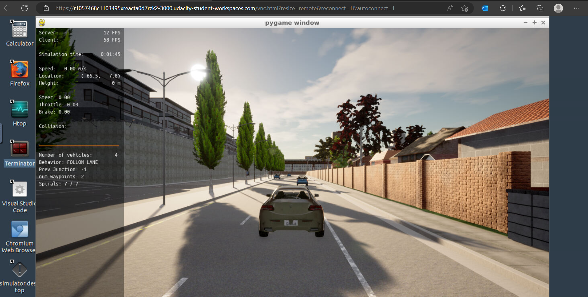

Then filled in the rest and started testing various parmeters.

**#01:** Starting very conservatively and following the approach describe above, we just set a very and much too small P: The error stayed constant at 3, and the car was still not moving at all:
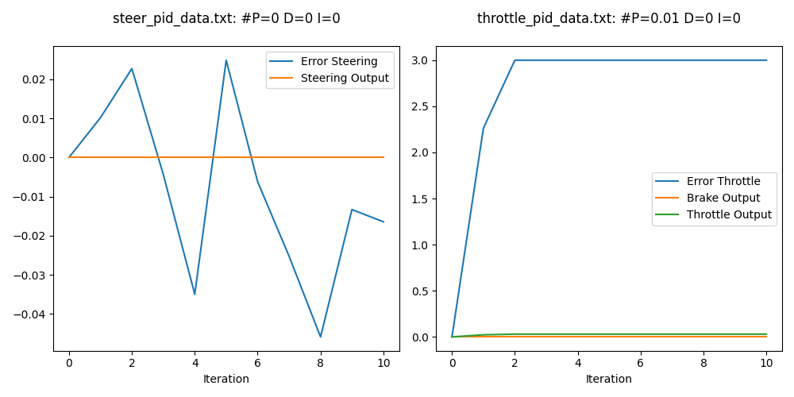

**#02:** After increasing P some speed is seen, unclear if this are the desired oscillations or just noise in the throttle error.
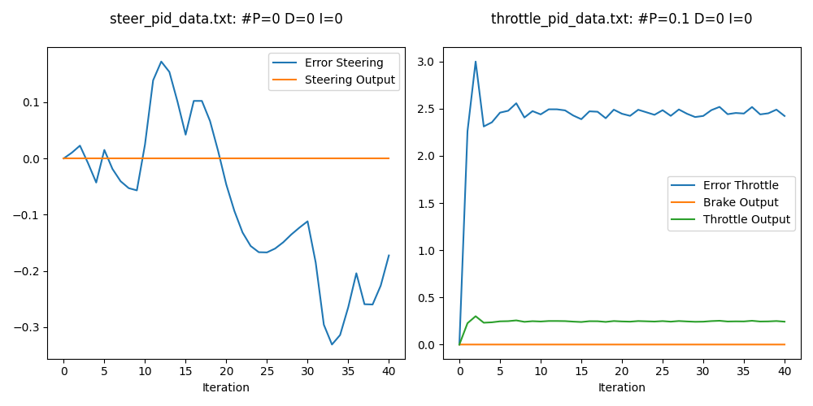

**#03:** Trying to dampen the noise a bit this actually creates more noise.. so what we saw is just noise and not the desired dampening? 
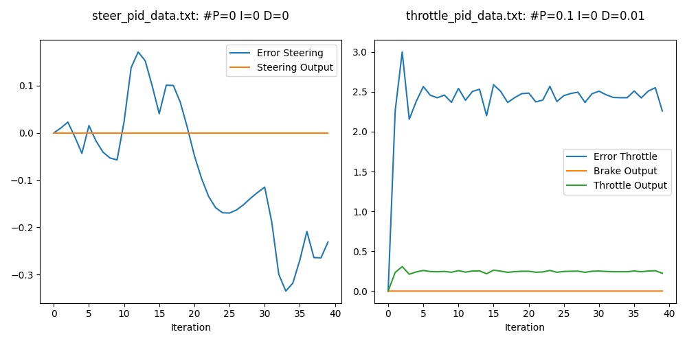

**#04:** Just doublechecking, more D doesn't change anything.
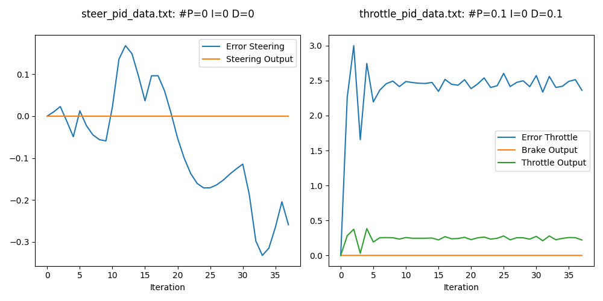

**#05:** Doubling P, we now see huge oscillations, that are also not enough dampened by a higher D.
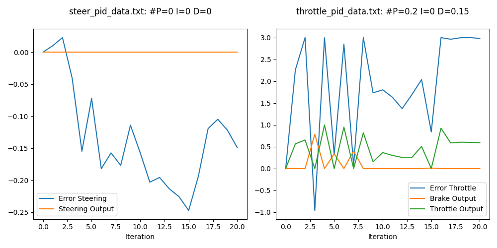

**#06:** Trying to add some I, but will realize later much too high, should have get the other better before, or not at the same time modified other parameters as well.
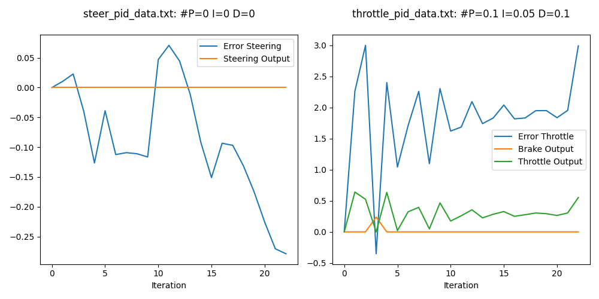

**#07:** Anyway, after realizing that steering will also depend heavily of the vehicle keeping up with the planned route, we start trying to find coefficients for that too. First attempt looks not too bad, and one can see how output follows the control error.
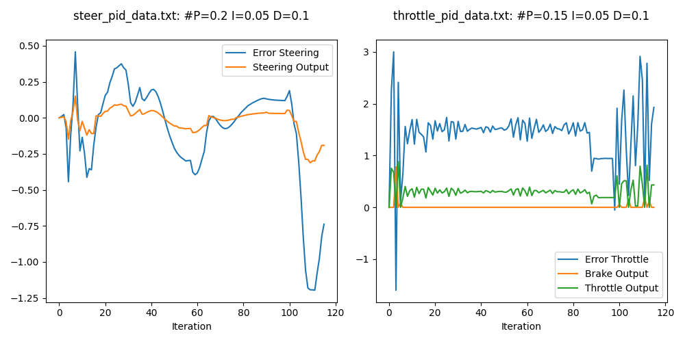
**#08:** Playing with it further, we arrived at parameters that steered badly.
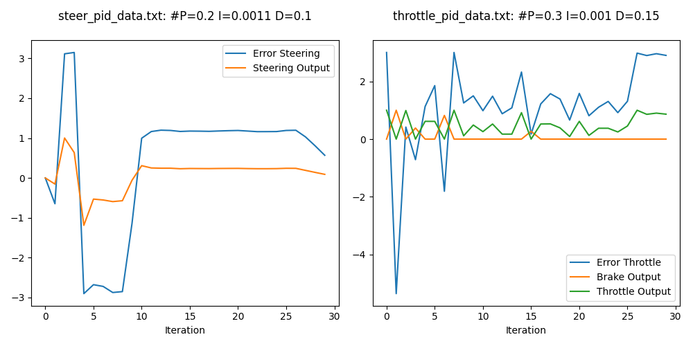

**#09:** and then also getting huge throttle oscillations, despite speed staying too slow.
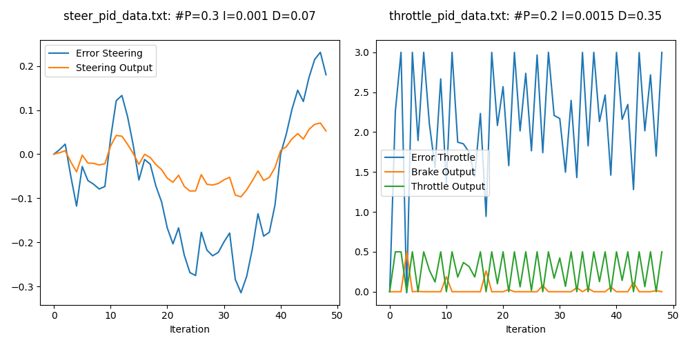

**#10:** In the final run, we see again a stabilized throttle, and also still a constant offset from the target speed. However, for going faster the whole feedback loop seemed just to unresponsive and would always start oscillating and steer off or in some obstacle then. The key to getting the last one through the parcour in the end seemed to go back to best values, and then also limit the outsputs further. Steer output follows again nice its error, and always is brought back close too zero.
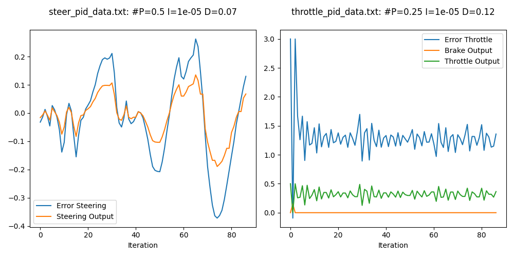

Questions
=========

What is the effect of the PID according to the plots, how each part of the PID affects the control command?
-----------------------------------------------------
- P is the proportional factor the controls the output depending on the error.
- D dampens this by taking the change of error into account.
- I compensates a long-term systematic error by integrating over all errors.

How would you design a way to automatically tune the PID parameters?
This is an open question, the coherence and justification of the answer is valued.
-----------------------------------------------------
One option for automation would be to add command line parameters to the controller, so one can pass the 6 (or with the limtits 8) parameters.

I then would implement a wrapping runner script that changes parameters similar to the wiggling showed in the course, starting with P, then D and then Is and maybe repeatedly let them wiggle after each other. 

One would also need to calculate some aggregated reasonable error from those runs to decide on improvement in an automated fashion, maybe just the distances between actual positions and planned ground truth.

PID controller is a model free controller, i.e. it does not use a model of the car. Could you explain the pros and cons of this type of controller?
Find at least 2 pros and cons for model free versus model based.
-----------------------------------------------------
Advantage: Model free is simple and universally applicable.

Advantage. Keeps the same behaviour across all operating conditions.

Disadvantage: If different responses are needed in different operating conditions, a model based controller can handle that better. E.g.: Yaw and speed are not independent, but both together impact the trajectory of a car. At higher speeds, one wants usually less yaw.

Disadvantage: Unstable if not tuned well. 

Disadvantage: Good for single output, harder when one wants to control multiple outsputs that impact each other.

What would you do to improve the PID controller?
This is an open question, the coherence and justification of the answer is valued.
-----------------------------------------------------
- Would experiment with was described above: Try to combine the PIDs: higher speed dampens the yaw output proportionally
- Also have a look at the motion planner: Does it really just play a planned trace with its own (false) view of the expected car position and not use the actual car position? This makes tuning a pain.

